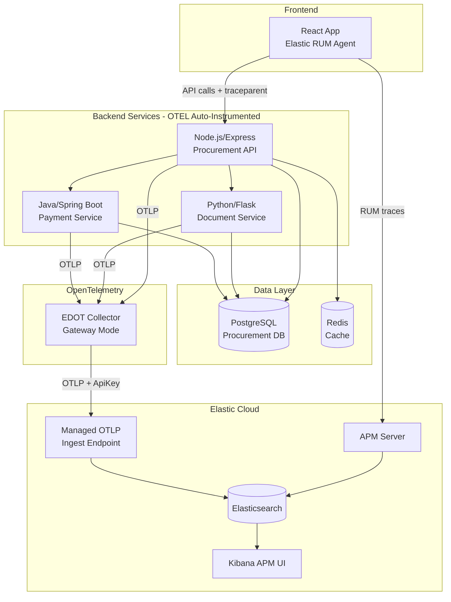
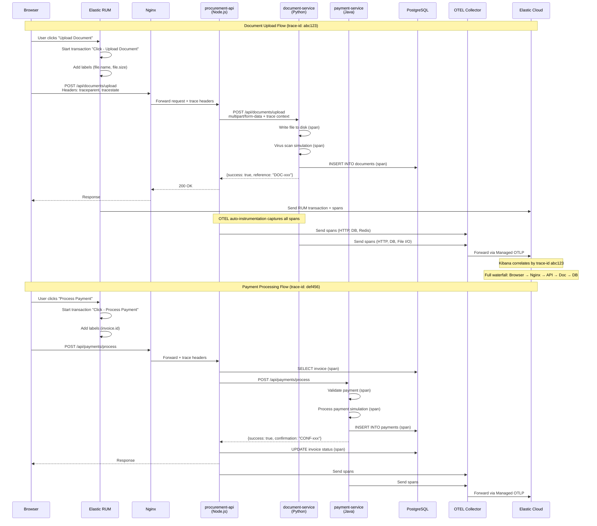

# Government Procurement APM Demo

[](https://opensource.org/licenses/MIT)
[](https://www.elastic.co/)
[](https://opentelemetry.io/)
[](https://kubernetes.io/)

[](https://nodejs.org/)
[](https://www.python.org/)
[](https://openjdk.org/)
[](https://react.dev/)

[](https://www.postgresql.org/)
[](https://redis.io/)
[](https://www.docker.com/)

A comprehensive demonstration of Elastic APM with OpenTelemetry auto-instrumentation, showcasing end-to-end distributed tracing from browser to database across a microservices architecture.

## Overview

This demo implements a Government Procurement System with full observability:

- **Real User Monitoring (RUM)** - Captures browser-side performance and user interactions
- **Distributed Tracing** - End-to-end trace correlation from click to database query
- **Auto-Instrumentation** - Zero-code instrumentation via OpenTelemetry Kubernetes Operator
- **Multi-Language Services** - Node.js, Python, and Java services working together

## Architecture



## Distributed Tracing Flow

This diagram shows how a document upload flows through the system with full trace correlation:



## Features

### Frontend (React + Elastic RUM)

- **Dashboard** - Real-time procurement metrics and statistics
- **Vendor Management** - Create and manage vendors
- **Invoice Tracking** - Create invoices, submit for approval
- **Document Upload** - Actual file upload with processing simulation
- **Payment Processing** - Process payments with audit trail
- **Service Status Panel** - Live health status of all backend services
- **Architecture Modal** - Interactive diagrams (click footer version text)

### RUM Instrumentation

- **Custom Transaction Names** - User-friendly names via `data-transaction-name` attributes
  - "Click - Upload Document", "Click - Process Payment", etc.
- **Custom Labels** - Business context attached to transactions
  - File uploads: `file.name`, `file.size_bytes`, `file.type`
  - Payments: `invoice.id`, `payment.success`, `payment.amount`
- **Session Tracking** - User journey correlation
- **Long Task Monitoring** - JavaScript performance tracking

### Backend Services

| Service | Technology | Port | Purpose |
|---------|------------|------|---------|
| procurement-api | Node.js/Express | 3000 | API Gateway, orchestration |
| document-service | Python/Flask | 5000 | Document upload, validation |
| payment-service | Java/Spring Boot | 8080 | Payment processing |
| postgres | PostgreSQL 15 | 5432 | Primary database |
| redis | Redis 7 | 6379 | Caching layer |

### Auto-Instrumentation

All backend services are automatically instrumented by the OpenTelemetry Kubernetes Operator:

```yaml
annotations:
  instrumentation.opentelemetry.io/inject-nodejs: "opentelemetry-operator-system/elastic-instrumentation"
  instrumentation.opentelemetry.io/inject-python: "opentelemetry-operator-system/elastic-instrumentation"
  instrumentation.opentelemetry.io/inject-java: "opentelemetry-operator-system/elastic-instrumentation"
```

No code changes required - the operator injects the instrumentation agent at pod startup.

## Project Structure

```
Elastic-OTEL-APM/
├── procurement-frontend/          # React frontend with Elastic RUM
│   ├── src/
│   │   ├── index.js              # RUM initialization
│   │   ├── App.js                # Main app with APM integration
│   │   └── App.css               # Styling
│   ├── .env.template             # Template for env vars (commit)
│   ├── .env                      # Actual APM config (gitignored)
│   ├── .gitignore                # Excludes .env, node_modules, build
│   ├── nginx.conf                # Proxy config with trace header forwarding
│   └── Dockerfile                # Multi-stage build
│
├── procurement-api/               # Node.js API Gateway
│   ├── server.js                 # Express routes, service orchestration
│   └── Dockerfile
│
├── document-service/              # Python Document Service
│   ├── app.py                    # Flask app with file handling
│   ├── requirements.txt
│   └── Dockerfile
│
├── payment-service/               # Java Payment Service
│   ├── src/main/java/com/procurement/payment/
│   │   ├── PaymentServiceApplication.java
│   │   ├── controller/PaymentController.java
│   │   ├── model/Payment.java
│   │   └── repository/PaymentRepository.java
│   ├── pom.xml
│   └── Dockerfile                # Multi-stage Maven build
│
├── procurement-demo.yaml          # Kubernetes deployment manifest
├── elastic-otel-values-0.12.6.yaml # OTEL Collector Helm values
│
├── # Configuration Files
├── .gitignore                     # Excludes .env and k8s-secrets.yaml
├── k8s-secrets-template.yaml      # Template for Elastic credentials (commit)
├── k8s-secrets.yaml               # Actual Elastic credentials (gitignored)
├── k8s-config-template.yaml       # Documents values to customize
│
└── old-project/                   # Archived previous demo files
```

## Configuration

### Frontend Environment Variables

The React frontend uses environment variables for APM configuration. These are baked in at build time.

**Setup:**
```bash
cd procurement-frontend
cp .env.template .env
# Edit .env with your values
```

**Required variables in `.env`:**

| Variable | Description | Example |
|----------|-------------|---------|
| `REACT_APP_APM_SERVER_URL` | Elastic APM Server URL | `https://your-cluster.apm.region.aws.found.io` |
| `REACT_APP_API_DOMAIN` | Your application domain | `https://your-domain.com` |

### Kubernetes Secrets

The OTEL Collector requires a secret for Elastic Cloud credentials.

**`k8s-secrets-template.yaml`** - Template for `elastic-secret-otel` with 6 required fields:

| Key | Purpose | Where to Find |
|-----|---------|---------------|
| `elastic_endpoint` | Elasticsearch node | Elastic Cloud > Deployment > Elasticsearch |
| `elastic_api_key` | Elasticsearch API key | Kibana > Stack Management > API Keys |
| `elastic_apm_endpoint` | APM Server | Elastic Cloud > Deployment > APM |
| `elastic_apm_secret_token` | APM secret token | Elastic Cloud > Deployment > APM |
| `elastic_ingest_endpoint` | Managed OTLP endpoint | Elastic Cloud > Deployment > Endpoints > OTLP |
| `elastic_ingest_api_key` | OTLP API key | Kibana > Stack Management > API Keys |

**Setup:**
```bash
cp k8s-secrets-template.yaml k8s-secrets.yaml
# Edit k8s-secrets.yaml with your Elastic Cloud values
kubectl apply -f k8s-secrets.yaml
```

Note: Database passwords use simple defaults (`procurement_pass`) since this is a demo.

### Kubernetes YAML Configuration

The following files contain environment-specific values that need to be updated:

**`procurement-demo.yaml`:**
- Docker image names (search for `skarter/`)
- Ingress hostname (search for `demo.myhousetech.net`)
- TLS secret name (search for `demo-tls-secret`)

**`k8s-config-template.yaml`** - Documents all values and provides sed commands for quick replacement.

**`elastic-otel-values-0.12.6.yaml`:**
- Cluster-specific URLs if applicable

## Deployment

### Prerequisites

- Kubernetes cluster with kubectl access
- OpenTelemetry Operator installed
- Elastic Cloud deployment with APM enabled
- Docker Hub account (for pushing images)

### 1. Configure Frontend Environment

```bash
cd procurement-frontend
cp .env.template .env
# Edit .env with your Elastic APM Server URL and domain
```

### 2. Create Kubernetes Secret for OTEL

```bash
# Option A: Use the template file
cp k8s-secrets-template.yaml k8s-secrets.yaml
# Edit k8s-secrets.yaml with your Elastic Cloud values, then:
kubectl apply -f k8s-secrets.yaml

# Option B: Create secret via kubectl
kubectl create secret generic elastic-secret-otel \
  --from-literal=elastic_endpoint=<APM_SERVER_URL> \
  --from-literal=elastic_api_key=<APM_API_KEY> \
  --from-literal=elastic_ingest_endpoint=<MANAGED_OTLP_ENDPOINT> \
  --from-literal=elastic_ingest_api_key=<MANAGED_OTLP_API_KEY> \
  -n opentelemetry-operator-system
```

### 3. Deploy OTEL Collector

```bash
helm upgrade --install opentelemetry-kube-stack open-telemetry/opentelemetry-kube-stack \
  --namespace opentelemetry-operator-system --create-namespace \
  -f elastic-otel-values-0.12.6.yaml
```

### 4. Build and Push Docker Images

```bash
# Frontend (ensure .env is configured first!)
cd procurement-frontend
docker build -t <dockerhub-username>/procurement-frontend:v14 .
docker push <dockerhub-username>/procurement-frontend:v14

# API
cd ../procurement-api
docker build -t <dockerhub-username>/procurement-api:v6 .
docker push <dockerhub-username>/procurement-api:v6

# Document Service
cd ../document-service
docker build -t <dockerhub-username>/document-service:v5 .
docker push <dockerhub-username>/document-service:v5

# Payment Service
cd ../payment-service
docker build -t <dockerhub-username>/payment-service:v1 .
docker push <dockerhub-username>/payment-service:v1
```

### 5. Update Kubernetes Manifests

Edit `procurement-demo.yaml` to update:
- Docker image names to match your Docker Hub username
- Ingress hostname to match your domain
- TLS secret name if using HTTPS

### 6. Deploy Application

```bash
kubectl apply -f procurement-demo.yaml
```

### 7. Verify Deployment

```bash
kubectl get pods -n demo-apps
kubectl get ingress -n demo-apps
```

## How It Works

### Trace Correlation (RUM + Backend)

1. **RUM Agent** captures user click and generates a `trace-id`
2. **Fetch API** automatically includes `traceparent` header
3. **Nginx** forwards trace headers to backend
4. **Backend services** (auto-instrumented) continue the trace
5. **OTEL Collector** receives spans and exports to Elastic Cloud
6. **Kibana APM** correlates all spans by `trace-id`

### Custom Labels Implementation

The frontend uses `getCurrentTransaction()` to add business context:

```javascript
// Get the auto-captured transaction (don't create new ones!)
const apm = window.__ELASTIC_APM__;
const transaction = apm?.getCurrentTransaction();

// Add custom labels for searchability in Kibana
transaction?.addLabels({
  'file.name': selectedFile.name,
  'file.size_bytes': selectedFile.size,
  'upload.success': true
});
```

**Important**: We add labels to the auto-captured transaction, not creating new transactions. This preserves full span visibility.

### Transaction Naming

Interactive elements use `data-transaction-name` attributes:

```html
<button 
  onClick={handleUpload} 
  data-transaction-name="Upload Document"
>
  Upload
</button>
```

Result: Transaction appears as "Click - Upload Document" in Kibana.

### File Upload Flow

1. User selects file in browser
2. RUM captures "Click - Upload Document" transaction
3. File sent as `multipart/form-data` to API
4. API forwards binary to Document Service
5. Document Service:
   - Writes file to temp storage
   - Simulates virus scan (timing span)
   - Validates format (timing span)
   - Stores metadata in PostgreSQL
   - Schedules file deletion (30s cleanup)
6. All operations visible as spans in trace

## Kibana APM Views

### Service Map
Shows all services and their connections:
- procurement-frontend (RUM)
- procurement-api (Node.js)
- document-service (Python)
- payment-service (Java)
- PostgreSQL database connections
- Redis cache connections

### Transactions
- Page loads with Web Vitals
- Route changes (/invoices, /payments, etc.)
- User interactions (Click - Upload Document, etc.)
- HTTP requests with full backend trace

### Traces
Click any transaction to see:
- Full waterfall from browser to database
- Span breakdown by type (http, db, app)
- Custom labels (file.name, etc.)
- Error highlighting

## Troubleshooting

### Document Service Not Appearing
- Verify Python version is 3.12 (required for OTEL gRPC compatibility)
- Check auto-instrumentation annotation is correct
- View pod logs: `kubectl logs -n demo-apps deployment/document-service`

### Missing Trace Correlation
- Ensure Nginx forwards `traceparent` and `tracestate` headers
- Verify `distributedTracingOrigins` includes your domain in RUM config
- Check OTEL Collector is receiving and exporting spans

### Custom Labels Not Showing
- Use `getCurrentTransaction()`, not `startTransaction()`
- Access APM at runtime via `window.__ELASTIC_APM__`
- Verify transaction is still active when adding labels

### Service Status Degraded
- Check health endpoints are responding
- Verify database connections
- Review service logs for errors

## Key Implementation Decisions

### Why Managed OTLP Endpoint?
- Enables RUM + backend trace correlation
- Both RUM (via APM Server) and OTEL (via Managed OTLP) write to same Elasticsearch indices
- Kibana can show full end-to-end traces

### Why Auto-Instrumentation?
- Zero code changes for basic tracing
- Consistent instrumentation across languages
- Easy to update via Helm values
- Captures database queries, HTTP calls, Redis operations automatically

### Why getCurrentTransaction() Instead of startTransaction()?
- Preserves auto-captured HTTP spans
- Transaction naming via `data-transaction-name` works correctly
- Adding labels to existing transaction doesn't break span hierarchy
- Manual transactions would orphan the HTTP fetch spans

### Why Python 3.12?
- OTEL Python auto-instrumentation requires specific gRPC bindings
- Python 3.11 had compatibility issues with gRPC cython modules
- 3.12 provides stable OTEL support

## Success Criteria

- [x] Full distributed trace visible: Browser → API → Service → Database
- [x] "View full trace" button works (trace correlation)
- [x] Service map shows all 6 services connected
- [x] Database queries visible as spans with timing
- [x] RUM metrics (Web Vitals, page loads) captured
- [x] Custom transactions with meaningful names
- [x] Custom labels searchable in Kibana
- [x] Service status visible in frontend
- [x] Architecture diagrams accessible in app

## License

MIT License - See [LICENSE](LICENSE) for details.
